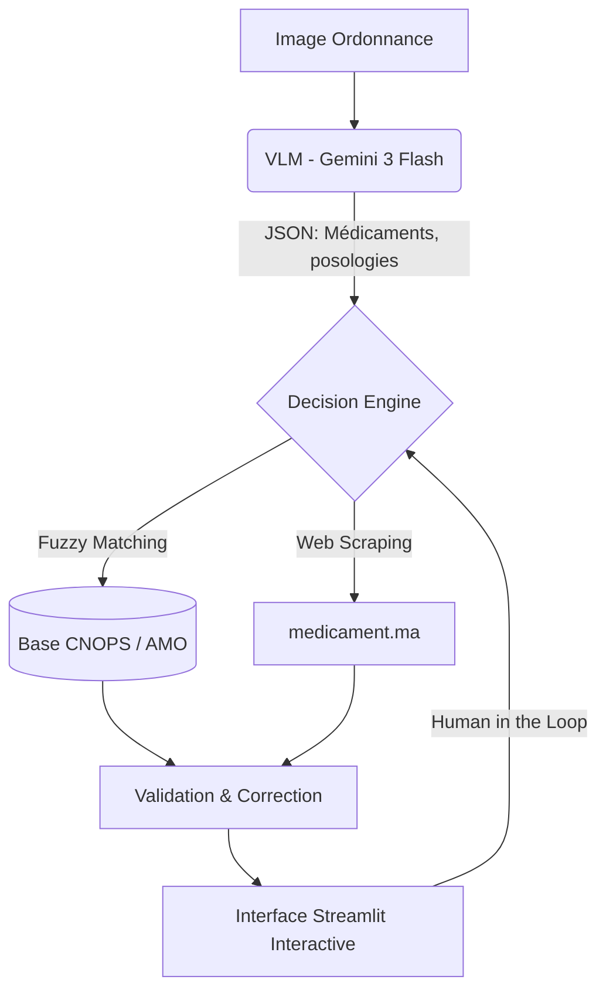

# Rapport Détaillé : Pipeline OCR Intelligent (SHIFA AI)

Ce rapport documente la nouvelle architecture du module d'analyse d'ordonnances médicales développée pour le projet **SHIFA AI**, remplaçant les anciennes tentatives basées sur des modèles OCR classiques.

## 1. Vue d'Ensemble de l'Architecture
Le système s'est transformé d'une approche "OCR Classique" (docTR / Donut) peu performante sur les écritures manuscrites complexes, vers une approche **VLM (Vision-Language Model)** propulsée par *Gemini 3 Flash*.

Cette architecture assure un taux de reconnaissance exponentiellement plus élevé, adossé à un **moteur de décision hybride** validant l'information sur des bases marocaines.

## 2. Les Composants Clés (`engine/vision_ocr/`)

### A. Extracteur VLM (`vlm_extraction.py`)
- **Rôle** : Reçoit l'image brute (photo, scan, webcam) et l'envoie à l'API OpenRouter.
- **Fonctionnement** : Un prompt strict force le modèle à retourner uniquement une structure de données `JSON` claire.
- **Données extraites** : Nom du médicament, dosage, posologie exacte, et durée du traitement.

### B. Moteur de Décision (`decision_engine.py` & `correction.py`)
Le VLM peut se tromper sur une lettre d'un nom de médicament complexe. Ce module agit comme un filet de sécurité :
- Il utilise **RapidFuzz** pour comparer le nom extrait avec la liste complète des 5900+ médicaments marocains.
- Il redresse les petites erreurs d'orthographe (ex: *Dolyprann* → *Doliprane*).

### C. Le Scraper Marocain (`scraper_medicament_ma.py`)
- **Rôle** : Enrichit les données de manière dynamique.
- **Données récupérées** : Le prix public de vente au Maroc (en MAD) et le type de traitement (Princeps ou Générique).
- **Performance** : Inclut un système de cache LRU pour ne pas ralentir le système ni surcharger le site source.

### D. Interface Homme-Machine Interactive (`ui/ordonnance_ui.py`)
L'interface de la page `📋 مسح الوصفة` a été totalement repensée pour passer d'un affichage passif à une interface de **double-vérification médicale** (Human-in-the-Loop) :
- **Indicateurs visuels** : Badges de validation CNOPS, barres de niveau de confiance.
- **Correction directe** : Si l'IA se trompe, le pharmacien peut corriger une lettre (ou supprimer le médicament) depuis le panneau `⚙️ Action : Corriger ou Supprimer`. La modification relance instantanément les vérificateurs (Prix et CNOPS).
- **Ajout manuel** : Possibilité de compléter l'ordonnance si l'image était trop floue.

## 3. L'Abandon de l'Ancienne Piste
> [!NOTE]
> **Pourquoi avons-nous supprimé EasyOCR, PaddleOCR et DocTR ?**
> Ces outils lisent lettre par lettre de manière déconnectée. Face à l'écriture "en attaché" des médecins, un OCR classique rend du texte incompréhensible. Le nouveau modèle VLM (Gemini) analyse l'intégralité du contexte de l'image pour *déduire* le mot médical exact, offrant ainsi un taux de réussite quasi parfait.

## 4. Points Forts de la Nouvelle Version
- **Zéro charge locale** : L'analyse lourde de l'image ne fait plus brûler la RAM de l'ordinateur portable, car elle est déléguée au cloud de Gemini via OpenRouter.
- **Interopérable** : L'utilisation de bases structurées locales (Fichiers Excel CNOPS/AMO) permet une prise de décision finale qui respecte strictement le référentiel sanitaire marocain.
- **Robuste aux cas réels** : Même coupée ou avec un mauvais éclairage, l'IA et l'opérateur humain collaborent intelligemment.
