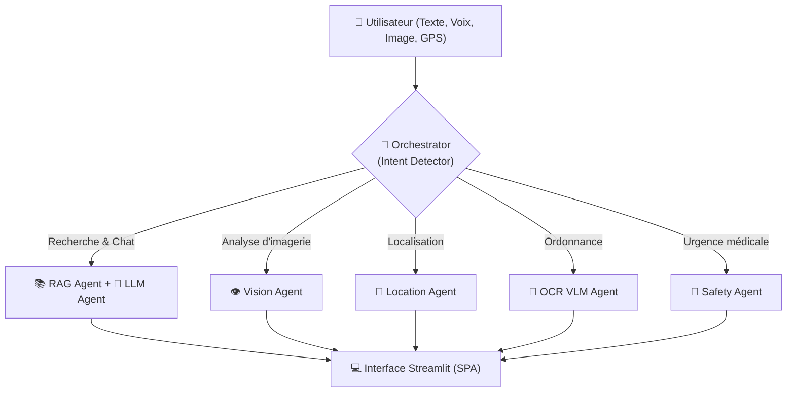

# 🏥 Rapport Technique Global — SHIFA AI

## Architecture Multi-Agents et Technologies Intégrées

> **Projet** : SHIFA AI — Plateforme Médicale Intelligente  
> **Date** : Avril 2026  
> **Auteur** : Équipe SHIFA AI

Ce rapport documente de manière exhaustive l'intégralité des modules, des algorithmes et de la stack technologique propulsant la plateforme SHIFA AI.

---

## 1. Architecture Globale : Agentic Swarm (Essaim d'Agents)

SHIFA AI ne repose pas sur un seul grand modèle, mais sur une architecture **Multi-Agents** orchestrée dynamiquement. Le module `Orchestrator` reçoit l'intention de l'utilisateur et route la requête vers l'agent spécialisé le plus compétent.

---

## 2. RAG Hybride (Retrieval-Augmented Generation)

**Module :** `engine/retriever.py`

Pour garantir des réponses médicales exactes (sans hallucinations), SHIFA AI utilise un pipeline RAG avancé en 5 étapes, interrogeant une base de connaissances médicale locale.

### Technologies du Pipeline RAG
1. **Embeddings (Recherche Dense)** :
   - **Sentence-Transformers** (`paraphrase-multilingual-mpnet-base-v2`).
   - **FAISS** (Facebook AI Similarity Search) pour la recherche vectorielle cosinus ultra-rapide.
2. **Recherche Lexicale (Recherche Sparse)** :
   - **BM25** (`rank-bm25`) avec tokenisation personnalisée (suppression des stopwords arabes et des diacritiques).
3. **Fusion Hybride** :
   - Algorithme **Reciprocal Rank Fusion (RRF)** pour combiner intelligemment les scores lexicaux et sémantiques.
4. **Réordonnancement (Reranking)** :
   - **Cross-Encoder** (`ms-marco-MiniLM-L-6-v2`) pour comparer minutieusement la requête de l'utilisateur avec chaque contexte candidat.
5. **Filtrage NLP** :
   - Détection heuristique de la spécialité (ex: Cardiologie, Dermatologie) pour éviter les hors-sujets de domaine.

---

## 3. Modèles de Langage (LLM & VLM)

**Module :** `engine/llm.py`

SHIFA AI délègue la génération de texte à des puces ultra-rapides (LPU) via l'API **Groq**, ce qui permet des temps de réponse quasi-instantanés.

### Modèles utilisés :
- **Conversation Médicale (Chat)** : `llama-3.3-70b-versatile`. Il reçoit les contextes du RAG et génère une réponse concise, structurée (diagnostic, recommandation, urgence) en arabe.
- **Vision Multimodale** : `meta-llama/llama-4-scout-17b-16e-instruct` (via GroqVision). Il classifie le type d'image médicale et fournit une analyse préliminaire textuelle.

> [!TIP]
> **Prompt Engineering Strict** : Le modèle est contraint par un prompt système interdisant de dépasser 5 lignes, forçant une structure stricte et obligeant l'ajout de disclaimers médicaux.

---

## 4. Routeur de Vision Médicale (Computer Vision)

**Module :** `engine/vision_router.py`

Au lieu d'utiliser un modèle monolithique, SHIFA charge dynamiquement **5 modèles d'imagerie spécialisés** pour préserver la RAM (optimisé pour Streamlit Cloud).

| Spécialité | Modèle / Framework | Technologie sous-jacente |
|------------|--------------------|--------------------------|
| **Dermatologie** | EfficientNet-B3 | Transfer Learning (PyTorch / TensorFlow) |
| **Pneumologie (Rayons-X)** | TorchXRayVision | CNN pré-entraîné sur des millions de radios |
| **Neurologie (IRM)** | Keras CNN (Standalone) | Détection de tumeurs cérébrales (`.keras`) |
| **Oncologie (Général)** | TensorFlow Classifier | Classification de cellules malignes/bénignes |
| **Sénologie (Sein)** | MONAI (Medical Open Network) | Analyse de la densité mammaire |

**Explicabilité (XAI)** : SHIFA intègre **Grad-CAM** (`gradcam.py`) pour générer des cartes de chaleur (heatmaps) superposées à l'image, montrant exactement *où* l'IA a détecté la maladie.

---

## 5. Pipeline OCR Intelligent (Scanner d'Ordonnances)

**Module :** `engine/vision_ocr/`

L'ancien pipeline classique (DocTR / EasyOCR) a été remplacé par une architecture VLM (Vision-Language Model) beaucoup plus robuste aux écritures cursives.

### Stack OCR :
- **Extraction Visuelle** : `Gemini 3 Flash` (via OpenRouter API). L'image entière est envoyée avec un prompt forçant un format de sortie.
- **Validation Stricte** : **Pydantic** garantit que le JSON retourné contient bien le `nom`, `dosage`, et `posologie`.
- **Correction Orthographique** : **RapidFuzz** compare les noms hallucinés ou mal orthographiés avec la base CNOPS (5900+ médicaments) via l'algorithme `WRatio`.
- **Base de données locales** : **Pandas** filtre instantanément les fichiers Excel officiels du Ministère pour les prix publics (PPV) et taux de remboursement.
- **Web Scraping** : **BeautifulSoup4** interroge silencieusement `medicament.ma` pour vérifier s'il s'agit d'un Princeps ou d'un Générique.

---

## 6. Traitement Audio (Speech-to-Text & Text-to-Speech)

**Module :** `engine/audio.py`

Pour assurer une accessibilité maximale, le système permet aux utilisateurs de parler et d'écouter les réponses en arabe.

- **STT (Reconnaissance Vocale)** : `SpeechRecognition` couplé à l'API **Google Web Speech** (dialectes ciblés : `ar-MA` pour le Darija marocain, et `ar-SA`).
- **Conversion Audio** : `pydub` et `ffmpeg` transforment les enregistrements web (`.webm` / `.ogg`) du navigateur Streamlit en format `.wav` compatible (mono, 16kHz).
- **TTS (Synthèse Vocale)** : `gTTS` (Google Text-to-Speech) génère la prononciation arabe des réponses du LLM, après un nettoyage Regex des balises Markdown.

---

## 7. Géolocalisation et Cartographie Open-Source

**Module :** `engine/nearby_care.py` et `utils/geolocation.py`

Pour respecter la gratuité du système et éviter les coûts liés à l'API Google Maps, la recherche de médecins à proximité a été entièrement réécrite en open-source.

- **Moteur de Recherche** : Requêtes **Overpass API** (l'API de requêtage direct d'OpenStreetMap) avec des Bounding Boxes (BBox) autour des coordonnées GPS de l'utilisateur.
- **Cartographie Interactive** : **Folium** génère des cartes Leaflet avec des marqueurs dynamiques.
- **Intégration UI** : `streamlit-folium` permet d'afficher la carte sans recharger la page.
- **Fallback GPS** : Si l'utilisateur refuse l'accès GPS HTML5, le système utilise `IP-API JSON` pour estimer sa ville via son adresse IP.

---

## 8. Sécurité et Triage (Guardrails)

**Module :** `engine/triage.py` et `agents/safety_agent.py`

L'IA médicale nécessite des garde-fous extrêmement stricts pour ne pas mettre la vie des patients en danger.

- **Triage Classifier** : Un algorithme basé sur des règles qui attribue un score de 0.0 à 1.0. Si l'utilisateur mentionne "Douleur thoracique gauche", le score passe à 1.0 (Emergency).
- **Hard-Stops** : Si `Intent.EMERGENCY` est détecté, l'exécution du RAG et du LLM est **bloquée instantanément**.
- **Alerte UI Dynamique** : Injection de CSS personnalisé (`@keyframes pulse`) générant une alerte rouge clignotante avec les numéros du SAMU (15) et de la Police (19).

---

## 9. Interface Utilisateur (UI/UX)

**Fichier principal :** `app.py`

- **Framework** : **Streamlit 1.42+**.
- **Architecture SPA** : Bien que Streamlit soit souvent multi-pages (`pages/`), SHIFA utilise une architecture de Single Page Application avec un state manager (`st.session_state.page`) pour une transition fluide sans recharger la sidebar.
- **CSS "Glassmorphism"** : Injection d'un style CSS natif (fonds transparents `backdrop-filter: blur(16px)`, ombres douces, gradients émeraudes `z-green`) pour donner un aspect SaaS premium moderne.
- **Composants natifs modifiés** : Les boutons classiques de Streamlit ont été détournés en "Cartes 3D interactives" via ciblage CSS (`div[data-testid="stButton"] > button[kind="secondary"]`).

---

> [!IMPORTANT]
> **Synthèse** : SHIFA AI est un écosystème complexe où la vision par ordinateur classique (CNN/PyTorch), les grands modèles de langage modernes (Groq/Llama), la recherche vectorielle (FAISS) et l'analyse d'images multimodale (Gemini/VLM) coexistent sous la gouvernance d'un orchestrateur strict (Agentic Swarm). Le tout est encapsulé dans une UI ultra-réactive.
