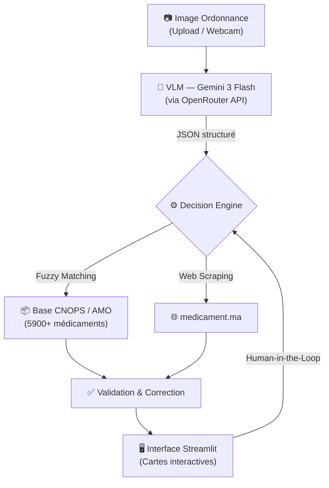
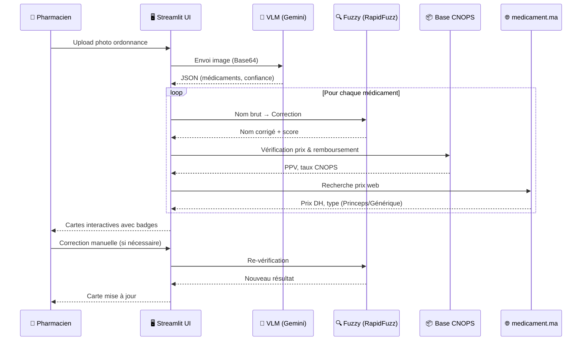

# 📋 Rapport Technique — Module OCR Intelligent (SHIFA AI)

## Analyse Détaillée des Technologies, Options et Composants

> **Projet** : SHIFA AI — Plateforme Médicale Intelligente  
> **Module** : Scanner d'Ordonnances (Prescription OCR)  
> **Date** : Avril 2026  
> **Auteur** : Équipe SHIFA AI

---

## 1. Vue d'Ensemble du Projet

SHIFA AI est une plateforme médicale intelligente qui intègre un **lecteur d'ordonnances IA** capable de :

- 🧠 **Comprendre** les ordonnances manuscrites et imprimées (français et arabe)
- 💊 **Extraire** automatiquement les informations sur les médicaments
- 📊 **Convertir** les données non structurées en un format JSON exploitable
- ✅ **Valider** les médicaments contre les bases pharmaceutiques marocaines (CNOPS/AMO)
- 💰 **Enrichir** les résultats avec les prix publics et le statut de remboursement



---

## 2. Architecture du Pipeline OCR

Le pipeline est organisé en **5 étapes séquentielles** dans le dossier `engine/vision_ocr/` :

| Étape | Fichier | Rôle | Technologie |
|-------|---------|------|-------------|
| 0 | `config.py` | Configuration centralisée | python-dotenv, Pandas |
| 1 | `vlm_extraction.py` | Extraction VLM depuis l'image | OpenRouter API, Gemini 3 Flash, Pydantic |
| 2 | `correction.py` | Correction des noms par fuzzy matching | RapidFuzz |
| 3 | `validators.py` | Validation CNOPS / Référentiel prix | Pandas |
| 4 | `scraper_medicament_ma.py` | Enrichissement prix & type via web | BeautifulSoup, Requests |
| 5 | `decision_engine.py` | Orchestration et score de confiance | Logique métier hybride |
| 6 | `ui/ordonnance_ui.py` | Interface utilisateur interactive | Streamlit |

---

## 3. Technologies Utilisées — Analyse Détaillée

### 3.1. LLM Vision — Gemini 3 Flash Preview (via OpenRouter)

> [!IMPORTANT]
> C'est le **cœur du système**. Au lieu d'utiliser un OCR classique lettre par lettre, on envoie l'image entière à un modèle de vision-langage (VLM) qui **comprend le contexte médical** pour déduire les noms des médicaments.

**Fichier** : `engine/vision_ocr/vlm_extraction.py`

#### Qu'est-ce qu'un VLM ?
Un **Vision-Language Model** (VLM) est un modèle d'IA capable de recevoir une image et du texte en entrée, et de générer une réponse textuelle. Contrairement à un OCR classique qui lit caractère par caractère, le VLM analyse l'**intégralité du contexte visuel** de l'image pour en déduire le contenu sémantique.

#### Pourquoi Gemini 3 Flash ?
- **Multimodal natif** : Accepte directement des images en entrée (pas besoin de pré-traitement)
- **Compréhension contextuelle** : Capable de lire l'écriture manuscrite des médecins en déduisant le mot médical probable
- **Sortie JSON structurée** : Le paramètre `response_format: json_object` force le modèle à retourner du JSON valide
- **Rapidité** : La variante "Flash" est optimisée pour la vitesse (< 5 secondes par ordonnance)
- **Coût** : Faible coût par requête via OpenRouter

#### Pourquoi OpenRouter ?
**OpenRouter** est un proxy API unifié qui permet d'accéder à plusieurs modèles (Gemini, Claude, Llama, etc.) via une seule clé API. Avantages :
- **Point d'accès unique** pour tous les modèles
- **Failover automatique** si un fournisseur est indisponible
- **Facturation centralisée** et transparente

#### Fonctionnement technique

```
Image (JPEG/PNG) → Encodage Base64 → Appel API OpenRouter → JSON structuré → Validation Pydantic
```

1. L'image est convertie en **Base64** (encodage binaire → texte)
2. Un **prompt système strict** guide le modèle pour extraire uniquement les données médicales
3. Le modèle retourne un JSON avec : médecin, patient, médicaments (nom, dosage, posologie, durée), confiance globale
4. Le JSON est validé par un **schéma Pydantic** pour garantir la structure

#### Prompt système utilisé
Le prompt force le VLM à agir comme un "assistant pharmacien expert au Maroc" et à :
- Identifier TOUS les médicaments prescrits
- Extraire nom commercial, dosage, posologie et durée
- Évaluer sa confiance de 0.0 à 1.0
- Retourner sa meilleure approximation si un nom est incertain

---

### 3.2. Pydantic — Validation Stricte des Données

**Fichier** : `engine/vision_ocr/vlm_extraction.py`

#### Qu'est-ce que Pydantic ?
**Pydantic** est une bibliothèque Python de validation de données utilisant les annotations de type. Elle garantit que les données reçues du VLM respectent un schéma précis.

#### Modèles définis dans le projet

| Modèle | Champs | Rôle |
|--------|--------|------|
| `Medecin` | `nom`, `specialite` | Informations du médecin prescripteur |
| `Patient` | `nom` | Nom du patient |
| `Medicament` | `nom`, `dosage`, `posologie`, `duree` | Un médicament prescrit |
| `OrdonnanceResult` | `medecin`, `patient`, `medicaments[]`, `confiance_globale` | Résultat complet |

#### Pourquoi Pydantic ?
- **Validation automatique** : Si le VLM retourne un JSON malformé, Pydantic lève une erreur explicite
- **Typage fort** : Chaque champ a un type précis (`str`, `float`, `list`)
- **Valeurs par défaut** : Les champs optionnels (`Optional[str]`) acceptent `null`
- **Contraintes** : La confiance est bornée entre 0.0 et 1.0 (`ge=0.0, le=1.0`)

---

### 3.3. RapidFuzz — Correction Orthographique par Fuzzy Matching

**Fichier** : `engine/vision_ocr/correction.py`

#### Le problème
Le VLM peut faire des erreurs mineures sur les noms de médicaments complexes :
- *Dolyprann* au lieu de **Doliprane**
- *Augmantyne* au lieu de **Augmentin**

#### La solution : Fuzzy Matching
**RapidFuzz** est une bibliothèque C++ ultra-rapide qui calcule la **distance d'édition** entre deux chaînes de caractères. Elle compare le nom extrait par le VLM avec les **5900+ médicaments** de la base CNOPS.

#### Algorithme utilisé : `WRatio`
Le scorer `fuzz.WRatio` (Weighted Ratio) est le plus robuste de RapidFuzz :
- Il teste plusieurs stratégies de comparaison (ratio simple, ratio partiel, tri des tokens)
- Il retourne le **meilleur score** parmi toutes les stratégies
- Score de 0 (aucune ressemblance) à 100 (identique)

#### Seuil de confiance
- **Score ≥ 80** : Le nom est corrigé automatiquement
- **Score < 80** : Le nom brut est conservé (trop différent pour être sûr)
- Le score est normalisé en `confidence` (0.0 à 1.0) pour le moteur de décision

#### Pourquoi RapidFuzz plutôt que FuzzyWuzzy ?
- **10 à 100x plus rapide** (implémentation C++)
- **Licence MIT** (FuzzyWuzzy utilise GPL)
- **API compatible** avec FuzzyWuzzy

---

### 3.4. Pandas — Chargement des Bases de Données Locales

**Fichier** : `engine/vision_ocr/config.py` et `engine/vision_ocr/validators.py`

#### Bases de données chargées

| Base | Fichier | Contenu | Lignes |
|------|---------|---------|--------|
| Référentiel Médicaments | `ref-des-medicaments-cnops-2014.xlsx` | Noms, prix PPV, prix hôpital, taux de remboursement | ~5900 |
| Dispositifs CNOPS | `dispositifs-medicaux-admis-au-remboursement-cnops-2014.xls` | Dispositifs médicaux remboursables | Variable |

#### Rôle de Pandas
- **Chargement unique** au démarrage via `pd.read_excel()` (évite les lectures répétées)
- **Recherche textuelle** avec `str.contains()` (case-insensitive)
- **Extraction de colonnes** : PPV (Prix Public de Vente), PH (Prix Hôpital), Taux de Remboursement

#### Vérifications effectuées

1. **`check_referentiel()`** : Cherche le médicament dans le référentiel des prix
   - Retourne : `prix_public`, `prix_hopital`, `taux_remboursement`
2. **`check_cnops()`** : Vérifie l'éligibilité au remboursement CNOPS
   - Recherche sur toutes les colonnes textuelles du dataset

---

### 3.5. BeautifulSoup + Requests — Web Scraping (medicament.ma)

**Fichier** : `engine/vision_ocr/scraper_medicament_ma.py`

#### Qu'est-ce que medicament.ma ?
C'est le **site de référence marocain** pour les prix des médicaments. Il contient les prix publics actualisés et le type de chaque médicament (Princeps ou Générique).

#### Fonctionnement du scraper

```
Nom médicament → URL de recherche → Requête HTTP GET → Parsing HTML → Extraction prix/type
```

1. Construction de l'URL : `https://medicament.ma/?s={nom_médicament}`
2. Requête HTTP avec un **User-Agent** réaliste (évite le blocage)
3. Parsing du HTML avec **BeautifulSoup** (`html.parser`)
4. Extraction des données :
   - **Titre** : Premier article `<h2>` ou `<h3>`
   - **Type** : Recherche du mot "générique" dans le texte → Générique ou Princeps
   - **Prix** : Regex `(\d+[\.,]?\d*)\s*(?:dh|dhs|mad)` pour extraire le montant en DH

#### Optimisation : Cache LRU
Le décorateur `@lru_cache(maxsize=256)` met en cache les 256 dernières recherches :
- Évite les requêtes réseau répétées pour le même médicament
- Améliore drastiquement les temps de réponse
- Réduit la charge sur le site source

#### Technologies

| Bibliothèque | Rôle |
|--------------|------|
| `requests` | Requêtes HTTP GET avec timeout de 10s |
| `beautifulsoup4` | Parsing et navigation du DOM HTML |
| `re` (regex) | Extraction du prix avec pattern matching |
| `functools.lru_cache` | Cache mémoire pour éviter les requêtes répétées |

---

### 3.6. Streamlit — Interface Utilisateur Interactive

**Fichier** : `ui/ordonnance_ui.py` et `app.py`

#### Qu'est-ce que Streamlit ?
**Streamlit** est un framework Python open-source pour créer des applications web de data science sans écrire de HTML/CSS/JS. Il transforme un script Python en une application web interactive.

#### Fonctionnalités UI du module ordonnance

| Fonctionnalité | Composant Streamlit | Description |
|----------------|---------------------|-------------|
| Upload d'image | `st.file_uploader()` | Glisser-déposer JPG/PNG/BMP/TIFF |
| Capture webcam | `st.camera_input()` | Photo directe depuis la webcam |
| Bouton d'analyse | `st.button()` | Déclenchement du pipeline VLM |
| Spinner de chargement | `st.spinner()` | Animation pendant l'analyse |
| Cartes médicament | `st.markdown()` (HTML) | Cartes glassmorphism stylisées |
| Barres de confiance | CSS `@keyframes` | Barres animées vert/jaune/rouge |
| Correction manuelle | `st.text_input()` + `st.button()` | Modifier un nom ou dosage |
| Ajout manuel | `st.form()` | Ajouter un médicament non détecté |
| Suppression | `st.button()` | Retirer un médicament erroné |

#### Design CSS avancé
L'interface utilise un design **glassmorphism** premium avec :
- **Fond semi-transparent** avec `backdrop-filter: blur(10px)`
- **Animations d'entrée** avec `@keyframes ordFadeIn`
- **Barres de confiance** colorées dynamiquement (vert > 75%, jaune > 50%, rouge < 50%)
- **Badges de validation** : ✓ Validé, ⚠️ Suspect, ✗ Non trouvé
- **Hover effects** avec `transform: translateY(-4px)`
- **Typographie** Google Fonts Cairo (arabe) + Inter (latin)

#### Approche Human-in-the-Loop
L'interface permet au pharmacien de :
1. **Vérifier** visuellement chaque médicament détecté
2. **Corriger** un nom ou dosage incorrect → relance automatique de la validation
3. **Supprimer** un médicament erroné
4. **Ajouter** manuellement un médicament non détecté par l'IA

---

### 3.7. Moteur de Décision Hybride — Orchestrateur Central

**Fichier** : `engine/vision_ocr/decision_engine.py`

#### Rôle
Le Decision Engine orchestre **toutes les vérifications** pour chaque médicament extrait et produit un **verdict final** avec un score de confiance combiné.

#### Pipeline de décision (3 étapes)

```
Nom brut VLM → [1] Correction Fuzzy → [2] Vérification Web → [3] Vérification Locale → Verdict
```

#### Calcul de la confiance combinée

```
Confiance = (VLM × 0.4) + (Fuzzy × 0.6)
```

- Le **fuzzy matching** a un poids de 60% car il vérifie contre la base officielle
- Le **VLM** a un poids de 40% car il peut halluciner des noms

#### Statuts de sortie

| Score combiné | Statut | Signification |
|---------------|--------|---------------|
| ≥ 0.75 | `valid` ✅ | Médicament confirmé dans la base |
| 0.50 – 0.74 | `suspect` ⚠️ | Probablement correct, vérification humaine recommandée |
| < 0.50 | `unknown` ❌ | Non identifié, intervention manuelle nécessaire |

#### Données de sortie enrichies
Pour chaque médicament, le moteur retourne :
- `corrected_name` : Nom corrigé par fuzzy matching
- `confidence` : Score combiné (0.0 à 1.0)
- `status` : valid / suspect / unknown
- `price` : Prix public en DH (via medicament.ma ou CNOPS)
- `remboursable` : Éligibilité au remboursement CNOPS
- `type` : Princeps ou Générique

---

## 4. Technologies Complémentaires du Projet SHIFA AI

### 4.1. Groq API — LLM pour la Conversation Médicale

**Fichier** : `engine/llm.py`

| Composant | Modèle | Usage |
|-----------|--------|-------|
| `GroqGenerator` | `llama-3.3-70b-versatile` | Conversation médicale en arabe |
| `GroqVision` | `meta-llama/llama-4-scout-17b-16e-instruct` | Analyse d'images médicales |

Groq est un fournisseur d'inférence LLM ultra-rapide utilisant des puces **LPU** (Language Processing Unit) spécialisées.

### 4.2. RAG — Retrieval-Augmented Generation

**Fichier** : `engine/retriever.py`

Pipeline de recherche hybride en **5 étapes** :

| Étape | Technique | Outil |
|-------|-----------|-------|
| 1 | Recherche sémantique dense | FAISS + Sentence-Transformers |
| 2 | Recherche lexicale sparse | BM25 (rank-bm25) |
| 3 | Fusion hybride | Reciprocal Rank Fusion (RRF) |
| 4 | Réordonnancement | Cross-Encoder MiniLM |
| 5 | Filtrage métadonnées | Spécialité médicale + qualité |

### 4.3. Vision Router — Analyse d'Images Médicales

**Fichier** : `engine/vision_router.py`

Routeur unifié gérant **5 types d'analyse d'images** avec chargement dynamique des modèles :

| Type | Module | Modèle |
|------|--------|--------|
| Dermatologie | `engine/dermato.py` | EfficientNet-B3 |
| Rayons-X | `engine/xray.py` | TorchXRayVision |
| IRM Cérébrale | `engine/brain_mri.py` | Keras CNN |
| Cancer | `engine/cancer.py` | TensorFlow |
| Densité mammaire | `engine/breast.py` | CNN spécialisé |

---

## 5. Pourquoi le VLM plutôt que l'OCR Classique ?

> [!NOTE]
> **Pourquoi avons-nous abandonné EasyOCR, PaddleOCR et DocTR ?**

### Comparaison directe

| Critère | OCR Classique | VLM (Gemini) |
|---------|--------------|--------------|
| **Méthode** | Lecture lettre par lettre | Compréhension contextuelle de l'image |
| **Écriture manuscrite** | ❌ Très faible (texte incompréhensible) | ✅ Excellent (déduit le mot médical) |
| **Pré-traitement** | Obligatoire (binarisation, débruitage) | Aucun nécessaire |
| **Charge locale** | Élevée (modèles lourds en RAM) | Zéro (traitement cloud) |
| **Contexte médical** | Aucun (lit les caractères sans comprendre) | Fort (connaît les noms de médicaments) |
| **Sortie** | Texte brut à parser | JSON structuré directement |
| **Temps de développement** | Élevé (pipeline complexe) | Faible (un seul appel API) |

### L'ancien pipeline (abandonné)

```
Image → Preprocessing (OpenCV) → OCR (DocTR/EasyOCR) → NLP (regex) → Résultat brut
```

**Problèmes** : 4 étapes fragiles, chaque erreur se propageait à la suivante.

### Le nouveau pipeline (actuel)

```
Image → VLM (Gemini) → JSON validé → Decision Engine → Résultat enrichi
```

**Avantage** : Un seul appel API remplace 3 modules (`preprocessing.py`, `ocr.py`, `nlp_extraction.py`).

---

## 6. Stack Technologique Complète

### Dépendances du module OCR

| Catégorie | Package | Version | Rôle |
|-----------|---------|---------|------|
| **API VLM** | `requests` | ≥ 2.31 | Appels HTTP vers OpenRouter |
| **Validation** | `pydantic` | ≥ 2.0 | Schéma et validation JSON |
| **Fuzzy Matching** | `rapidfuzz` | ≥ 3.0 | Correction des noms de médicaments |
| **Web Scraping** | `beautifulsoup4` | ≥ 4.12 | Parsing HTML de medicament.ma |
| **Données** | `pandas` | ≥ 2.0 | Chargement et recherche dans les fichiers Excel |
| **Configuration** | `python-dotenv` | ≥ 1.0 | Variables d'environnement (.env) |
| **UI** | `streamlit` | ≥ 1.42 | Interface web interactive |
| **Image** | `Pillow` | ≥ 10.0 | Manipulation d'images (PIL) |

### Variables d'environnement requises

```env
OPENROUTER_API_KEY=sk-or-...    # Clé API OpenRouter (pour le VLM)
GROQ_API_KEY=gsk_...            # Clé API Groq (pour le LLM conversationnel)
```

---

## 7. Points Forts de l'Architecture

| Avantage | Explication |
|----------|-------------|
| **Zéro charge locale** | L'analyse VLM est déléguée au cloud (pas de GPU requis) |
| **Interopérable** | Bases CNOPS/AMO locales pour validation officielle marocaine |
| **Robuste aux cas réels** | Fonctionne même avec images floues, mal cadrées ou manuscrites |
| **Human-in-the-Loop** | Le pharmacien peut corriger/valider chaque résultat |
| **Extensible** | Ajout d'un nouveau fournisseur VLM = changer 1 ligne (le modèle OpenRouter) |
| **Cache intelligent** | LRU cache sur le scraper pour éviter les requêtes réseau répétées |
| **Validation multi-niveaux** | VLM → Fuzzy → CNOPS → Web → Interface humaine |

---

## 8. Flux Utilisateur Complet



---

> [!CAUTION]
> **Avertissement légal** : Ce système est fourni à titre informatif uniquement. Il ne constitue pas un avis médical ni pharmaceutique. Conformément à la réglementation marocaine, seul un professionnel de santé habilité peut prescrire et délivrer des médicaments.
